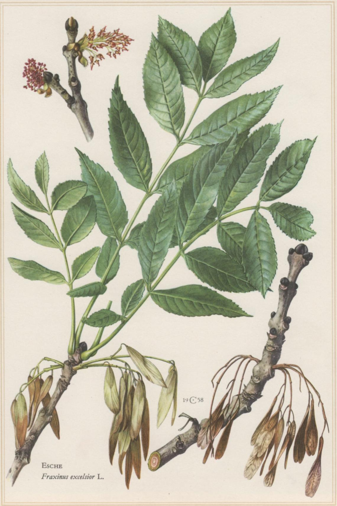
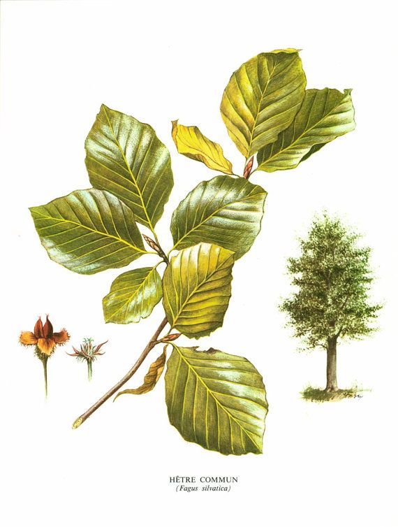
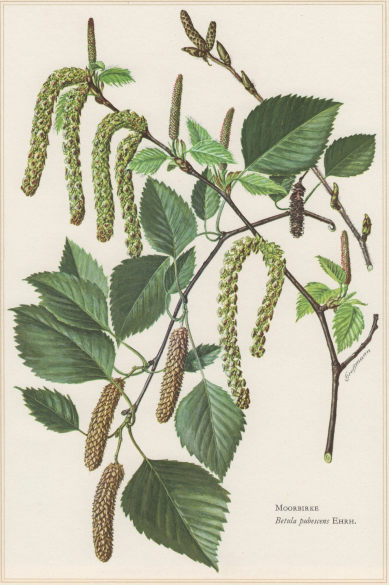

# [Ash](https://en.wikipedia.org/wiki/Fraxinus)

# [Beech](https://en.wikipedia.org/wiki/Beech)

Beech (Fagus) is a genus of deciduous trees in the family Fagaceae, native to
temperate Europe, Asia, and North America. The better known Fagus subgenus
beeches are high-branching with tall, stout trunks and smooth silver-grey bark.

Beeches are monoecious, bearing both male and female flowers on the same plant.
The small flowers are unisexual, the female flowers borne in pairs, the male
flowers wind-pollinating catkins. They are produced in spring shortly after the
new leaves appear. The fruit of the beech tree, known as beechnuts or mast, is
found in small burrs that drop from the tree in autumn. They are small, roughly
triangular and edible, with a bitter, astringent, or in some cases, mild and
nut-like taste. They have a high enough fat content that they can be pressed for
edible oil.

The leaves of beech trees are entire or sparsely toothed, from 5–15 cm (2–6 in)
long and 4–10 cm (2–4 in) broad. Beeches are monoecious, bearing both male and
female flowers on the same plant. The small flowers are unisexual, the female
flowers borne in pairs, the male flowers wind-pollinating catkins. They are
produced in spring shortly after the new leaves appear.

The bark is smooth and light grey. The fruit is a small, sharply three-angled
nut 10–15 mm (3⁄8–5⁄8 in) long, borne singly or in pairs in soft-spined husks
1.5–2.5 cm (5⁄8–1 in) long, known as cupules. The husk can have a variety of
spine- to scale-like appendages, the character of which is, in addition to leaf
shape, one of the primary ways beeches are differentiated.[3] The nuts are
edible, though bitter (though not nearly as bitter as acorns) with a high tannin
content, and are called beechnuts or beechmast.

# [Birch](https://en.wikipedia.org/wiki/Birch)

A birch is a thin-leaved deciduous hardwood tree of the genus Betula, in the
family Betulaceae, which also includes alders, hazels, and hornbeams. It is
closely related to the beech-oak family Fagaceae. They are a typically rather
short-lived pioneer species.

Birch species are generally small to medium-sized trees or shrubs, mostly of
northern temperate and boreal climates. The simple leaves are alternate, singly
or doubly serrate, feather-veined, petiolate and stipulate. They often appear in
pairs, but these pairs are really borne on spur-like, two-leaved, lateral
branchlets. The fruit is a small samara, although the wings may be obscure in
some species. They differ from the alders in that the female catkins are not
woody and disintegrate at maturity, falling apart to release the seeds, unlike
the woody, cone-like female alder catkins.

The bark of all birches is characteristically marked with long, horizontal
lenticels, and often separates into thin, papery plates, especially upon the
paper birch. Distinctive colors give the common names gray, white, black, silver
and yellow birch to different species.

The buds form early and are full grown by midsummer, all are lateral, no
terminal bud is formed; the branch is prolonged by the upper lateral bud. The
wood of all the species is close-grained with a satiny texture and capable of
taking a fine polish; its fuel value is fair.
