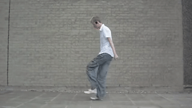
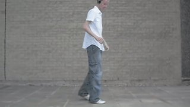
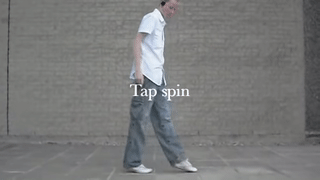

Shuffle steps are usually split each tempo into two phases, songs usually follow
a 4/4 structure. To differentiate the steps between tempos I'm going to use the
tempo number they come from followed by an `-and` so the structure will be:
`8-and`, `1`, `1-and`, `2`... Where the `1` is the phrase starter.

Most of the steps don't have names so I've put one that felt it fits.

To specify the relative position of body parts, I'm using an imaginary clock, so
12 means upfront, 3 our right, 6 our back and 9 our left.

The steps below can be danced with "slow" or quick tempos. It's best to learn
with the slow ones as they build the muscle memory to be able to skip parts of
it as you move to higher tempos.

# Running man

The running man is the basic step of Melbourne shuffle, so make sure to master
it.

* *8-and*: Both legs straight under our body, right leg lifted up
    with knee up front. Weight lies on the left foot.
* *1*: Right foot kicks forward, left foot slides backward, in a way that each travel the
    same distance. Weight is evenly shared between the feet.
* *1-and*: Right foot slides backwards, right foot goes up, knee to the front.
    Weight lies on the right foot.
* *2*: Mirrors *1*.
* *2-and*: Mirrors *1-and* and it's equal to *8-and*.

Once you feel comfortable with it, start going around the room doing running
mans, so you get a grasp of doing it without being stationary.

Sources: [1](https://www.youtube.com/embed/LbeRR_TDRVE?start=54), [2](https://www.youtube.com/embed/NVISfLc_z8c?start=18)

The foot going forward can land in the floor flat, heel first or toes first.

## Quick tempo Running man

As the tempo speeds up, even if it seems there is no time to stop in the *1-and*
or *2-and* they do manage to do so. I still need to figure how.

## Kicking-Running man

* *8-and*: Both legs straight under our body, right leg lifted up
    with knee up front. Weight lies on the left foot.
* *1*: Right foot kicks forward without touching the ground, it's important that
    the kick is clean, so swift till the end and stop suddenly. At the same time
    the left foot has slided back a little bit.
* *1-and*: Right foot is retrieved, knee up and foot parallel to the ground,
    left foot keeps on sliding back.
* *2*: Right foot hits the ground, left foot keeps on sliding, weight is evenly
    shared between feet like the *1* of the running man.

Sources: [1](https://www.youtube.com/embed/rOQa0gXan70?start=13)

# T-Step

The T-Step is other basic step of Melbourne shuffle, used to do lateral
movement.

## Learning the T-Step

The following instructions are a nice way to get the grasp of the movement, but
we'll change them slightly to be able to link it with the other moves.

* *8-and*: Both legs straight under our body, right leg lifted up
    with knee up front. Weight lies on the left foot, which looks at 1.5
    although the rest of you look at 12.
* *1*: Right foot kicks sideways towards 3, try to leave the foot at 90 degrees
    with your leg and that it doesn't wobble, so it's a clean kick. The weight
    is on the left leg's toes and it pivotes over them till it points to 10.5.
    Waist ends up turned.
* *1-and*: Right foot is retrieved till the left leg's knee, keeping the base
    parallel to the ground. Weight is on the left leg's heel and pivotes over
    it to reach the 1.5 position. Waist is straight now.
* *2*: Equal to *1*.
* *2-and*: Equal to *1-and*.
* *3*: Right foot goes front, left foot goes back to the running man stance.

To move to the other side is the mirror.

Keep the leg that holds you a bit bent so you don't harm your knee when
twisting.

The usual basic pattern of Melbourne shuffle is doing some running mans pointing
at 10.5, then doing a side step (like the T-step) to the right, then another
running man pointing to 1.5, finishing with another side step to the left.

To join the T-Step with the running man, when you are in the *1-and* make it the
*8-and* of the T-Step.

Sources: [1](https://www.youtube.com/embed/NVISfLc_z8c?start=88)
[2](https://www.youtube.com/embed/ia-06zXLa5E?start=755)

### Francis T-Step

I've seen that Francis when finishes his T-Step with the other leg. So instead
of moving the right leg in front and slide back the left (if we are going to the
right), he:

* *2-and*: Switch your weight to the right foot, lift the left while you keep on
    moving your body to your 3.
* *3*: Left foot touches ground at your 1.5, slide the right back to the running
    man stance.

What I like of this variation is that you conserve the energy, it makes total
sense. What it doesn't is that he is dancing with sandals `(¬º-°)¬`.

## Quick tempo T-Step

To improve the speed of your T-Steps, I'd put a song a little bit quicker than
you are comfortable and:

* Get familiarity with the movement of the foot in the ground:

    * Start with your right knee up in position *8-and* of the T-Step.
    * First focus only to move the feet that you've got in the floor, so when
        the *1* comes, start pivoting the foot a pair of tempos.
    * Put your right foot down and lift the left knee.
    * Wait 3 or 4 tempos and when the *1* comes, start going to the other side.

* Once you are comfortable with the movement, repeat the same exercise but doing
the kicks.
* Then instead of finishing with both feet under your body, finish in a running
    man stance.
* Then instead of starting with your knee up, start from the running man stance.

## Sacco kicks

Sacco kicks looks similar to the T-Step adding some side kicks. There are two
variations, either kick first in and then out or the other way around. I'm more
comfortable with the first and I think it gives an advantage when combining it
with the running man.

* *8-and*: Equal to the T-Step.
* *1*: The foot of the floor equal to the T-Step but the right foot kicks to
    your 10.5.
* *1-and*: Equal to the T-Step.
* *2*: The foot of the floor equal to the T-Step but the right foot kicks to
    your 3.

The advantage of the Sacco kicks is that as you are going to kick to your 10.5
in *1*, you can slide the left foot quite a lot to your back (from *8* to *1*), therefore gliding
further than with a simple T-Step (you only have half a tempo before you need to
put all your weight in your left leg because you need to twist).

!!! note ""
    Although the guy in the video slides the foot backwards when going to his
    left, try to do the twist of the T-Step.

(The guy is crazy, shuffling barefoot over gravel soil `(╯°□°)╯ ┻━┻`).

Source: [1](https://www.youtube.com/embed/1RHfw0IYrU8?start=598)

# Tap spin

* *8*: Feet at the end of a running man, we generate a slight upper body twist
    clockwise to load the twist.
* *8-and*: Left foot goes back to the body axes and the right foot goes to the
    body with knee up like a running man, with the difference that we release
    the twist energy and we start turning counterclockwise. Weight is on the
    left foot toes and it's knee is a little bit bent.
* *1*: Right foot kicks sideways towards 3 touching the ground but not putting
    any weight into it while we unbend the left knee taking the chance to keep
    the spin going.
* *1-and*: Right foot goes back to the body and left knee is again a little bit
    bent waiting for the next kick.
* *2*: Equal to *1*
* *2-and*: Equal to *1-and*
* *3*: Becomes the *1* of the running man.

You can spin as long as you want, I've explained a two times spin, but if you
want to go further repeat *1* and *1-and* as long as you want.

Sources: [1](https://www.youtube.com/embed/rOQa0gXan70?start=50)

# Basic crossing

* *8-and*: Left legs straight under our body, with the weight in the toes and
    the foot a little turned with the heel pointing to our right (7 o'clock),
    right leg lifted up straight to our 3 o'clock with toes pointing down.
    with knee up front. Weight lies on the left foot.
* *1*: Right foot crosses before the left one, toes touch the floor first in our
    longitudinal axes. The left foot pivots over the toes to end up pointing to
    our 11. Weight is evenly shared between the feet toes.
* *1-and*: Mirrors *8-and*.
* *2*: Mirrors *1*.
* *2-and*: Equal to *8-and*.

Sources: [1](https://www.youtube.com/embed/NVISfLc_z8c?start=41)

# Wiggle feet

* *8-and*: Both legs straight under our body, right leg lifted up
    with knee up front. Weight lies on the left foot.
* *1*: Right foot touches the floor behind the hips pointing to 10.5, left foot
    pivots over the toes to point to 1.5. Weight is even between feet.
* *1-and*: Right foot pivots on the heel till 1.5. Left foot pivots on the toes
    till 10.5.
* *2*: Equal *1*.
* *2-and*: Mirrors *1-and*.
* *3*: Equal *1*.
* *3-and*: Equal *1-and*.
* *4*: Equal *1*.

Sources: [1](https://www.youtube.com/embed/NVISfLc_z8c?start=119)

# Future steps

* [Francis spin](https://www.youtube.com/embed/TaUz1KCVdJg?start=160)
* [Rocky kicks](https://www.youtube.com/watch?v=1RHfw0IYrU8) at 13:26 or 27:58.
* [Recce kicks](https://www.youtube.com/watch?v=1RHfw0IYrU8) at 15:56 or 27:28 or 27:43 or 28:05.
* [Reverse kick spin](https://www.youtube.com/watch?v=1RHfw0IYrU8) at 18:01 or 27:65.
* [Forward kick spin](https://www.youtube.com/watch?v=1RHfw0IYrU8) at 19:33.

# References

## Where to discover more tutorials

* [Elements tutorial playlist](https://www.youtube.com/playlist?list=PLv695483ty5Nj0L0ZsAIiSAN62-lT6-3U)
* [Anderson Jovani playlist](https://www.youtube.com/playlist?list=PLPAWfysb_wUx259mARAAWuYttD7b6nauh)

## More videos to study

* [Rocky Shuffle compilation](https://www.youtube.com/watch?v=bxvEDvNJrNE)
