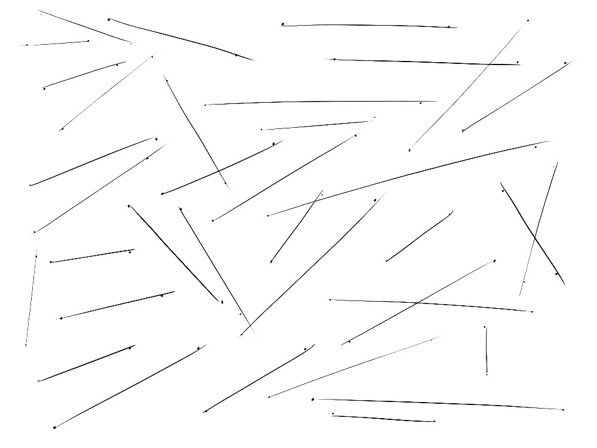
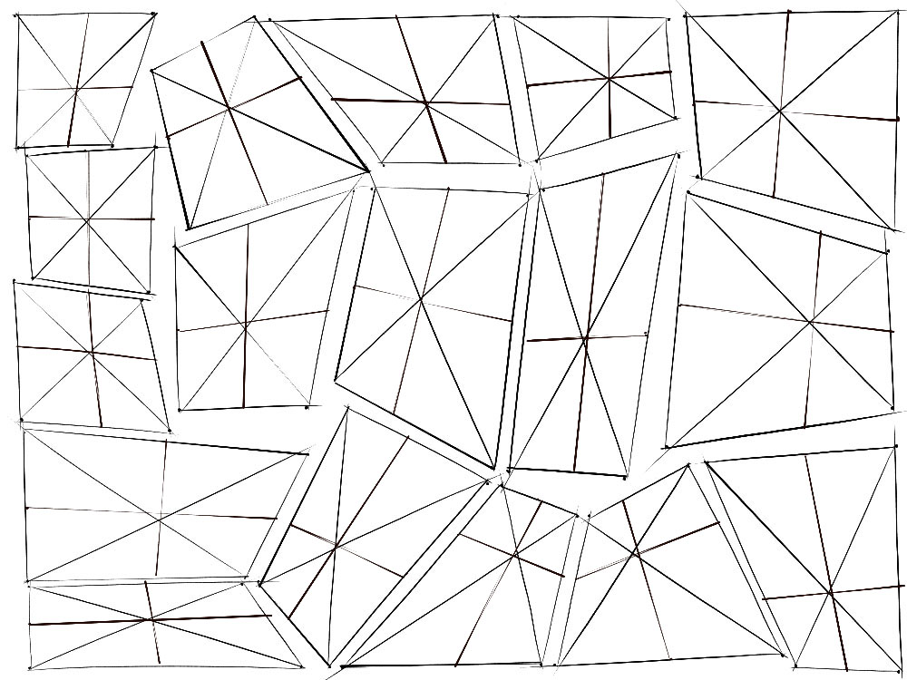

Set of exercises to maintain the fundamental skills required for drawing. Before
doing a drawing session, spend 10-20 minutes doing one or several of these
exercises.

* [Superimposed lines](https://drawabox.com/lesson/1/superimposedlines): for
    different increasing lengths (4cm, 8cm, half the width and full width), draw
    a line with a ruler and repeat the stroke freehand eight times. Also try
    some arcing lines, and even some waves. Make sure you fray only at the end.

    

    Example:

    

* [Ghosted lines](https://drawabox.com/lesson/1/9/purpose): Fill up a page with
    straight lines following the [ghosting method](drawing.md#ghosting).

    Special things to avoid:

    * [Wobbly lines](https://drawabox.com/lesson/1/9/wobbling)
    * [Arcing lines](https://drawabox.com/lesson/1/9/arc)

    There are several levels of success with this exercise:

    * *Level 1*: Line is smooth and consistent without any visible wobbling, but
        doesn't quite pass through A or B, due to not following the right
        trajectory. It's a straight shot, but misses the mark a bit.
    * *Level 2*: Like level 1 and maintains the correct trajectory. It does
        however either fall short or overshot one or both points.
    * *Level 3*: Like level 2 and also starts at right at one point and ends
        exactly at the other.

    Example:

    

* [Ghosted planes](https://drawabox.com/lesson/1/ghostedplanes): Fill up a page
    with planes using the [ghosting method](drawing.md#ghosting). Start with
    4 points, join them, then fill in the two diagonals, and then make a cross
    through the center of the X.

    Special things to avoid:

    * [Wobbly lines](https://drawabox.com/lesson/1/9/wobbling)
    * [Arcing lines](https://drawabox.com/lesson/1/9/arc)

    Example:

    

    As you repeat the exercise, you can start to envision these planes as being
    three dimensional rectilinear surfaces. The third and fourth steps, where we
    construct the diagonals and the cross can be treated as being a subdivision
    of the plane. The cross will require some estimation to find the center of
    each edge in space.
